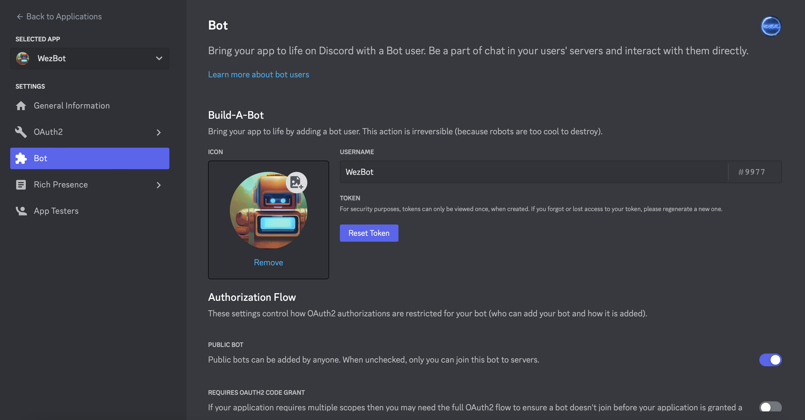

<div align="center">
    
</div>

<h1 align="center">Hi There, Welcome to BeatMaster repository ! </h1>
<h3 align="center">A multifunctional French bot</h3>

<!-- Badges -->
<div align="center">
    <a href="https://img.shields.io/github/license/IweZix/WezBot"></a>
    <a href="https://img.shields.io/github/forks/IweZix/WezBot"></a>
    <a href="https://img.shields.io/github/languages/count/IweZix/WezBot"></a>
    <a href="https://img.shields.io/github/issues-pr/IweZix/WezBot"></a>
</div>

<!-- Presentation -->
# 📜 Presentation
BeatMaster is a Discord bot that allows you to play music in a voice channel. It is also possible to create a playlist, to manage the music (pause, skip, stop, etc...).  You can [add](https://discord.com/api/oauth2/authorize?client_id=1170732142372859934&permissions=8&scope=bot%20applications.commands) BeatMaster to your server.

<!-- Installation -->
# 🛠️ Installation
> To install the bot, you must first clone the repository OR download the last [release](https://github.com/IweZix/BeatMaster/releases) :
```bash
git clone https://github.com/IweZix/BeatMaster.git
```
> Then, you must install the dependencies :
```bash
npm i
```
> Finally, you will need to create .env file at the root of the project and add the following lines :

```env
TOKEN="REPLACE BY YOUR BOT TOKEN"
COLOR="REPLACE BY YOUR COLOR IN HEXADECIMAL"
DEVELOPER_ID="914162418660302889"
VERSION="1.0"
```

#### 🔐 Token
<div align="center">
    
</div>

<br>

> You can now start the bot :
```javascript
npm start
```

# 📝 License

BeatMaster is licensed under the [GNU GPL v3.0](https://www.gnu.org/licenses/gpl-3.0.en.html)

If you want to use WezBot's code to create your own Discord bot, please upload your new code on GitHub mentioning IweZix

For any questions or requests, please contact me either by Discord **iwezix** or **contact@iwezix.xyz**